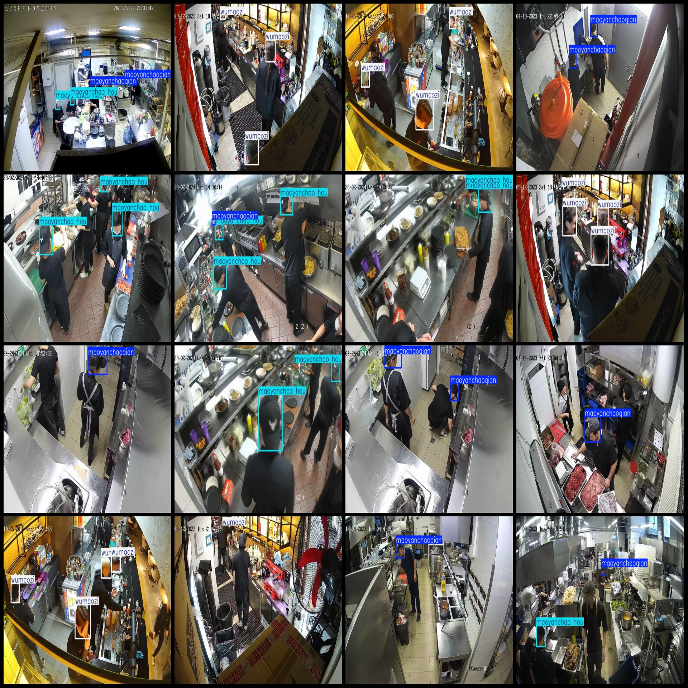
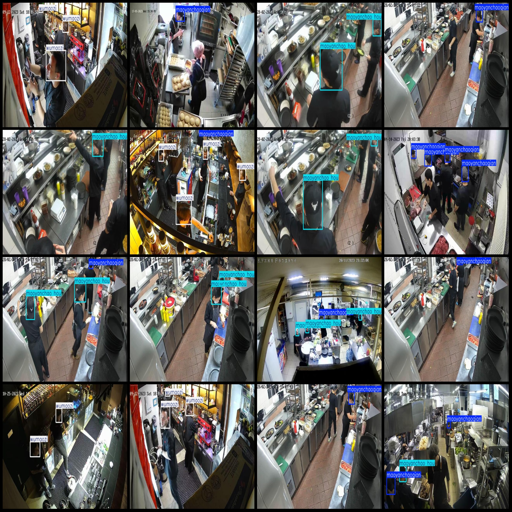

# Smart Kitchen Chef Hat Wearing Standards Detection Hat Brim Front or Back Dataset VOC+YOLO Format 2884 Images 3 Categories

Dataset format: Pascal VOC format + YOLO format (without split path in txtfile, only containing jpg image and corresponding VOC format xmlfile and yolo format txtfile)
number of images: 2883  
annotation count: 2883  
annotation count: 2883  
Label: 3
["Maoyan Chaohou", "Maoyan Chaoqian", "Wumaozi"]
["Backward Hat Brow", "Front Hat Brow", "None"]
boxes per class:   
maoyanchao hou box count = 2113  
maoyanchaoqian box count = 2622  
wumaozi box count = 2847  
total boxes: 7582  
images per class:   
maoyanchao hou images = 973  
maoyanchaoqian images = 1823  
wumaozi's possession of image counts = 1053
Image resolution: 640x384
Use the annotation tool: labelImg
Annotation rules: draw a rectangle around the class.
Important notes: The dataset does not have separate training, validation, and test sets. You need to partition them yourself.
Special statement: This dataset does not guarantee any accuracy for the trained model or weight files.
Image preview:
## Images

Here is a pay link on Stripe ( https://buy.stripe.com/3cs8yP7sY87d0vu9AB ). Please contact me lonlonago@foxmail.com after funding $89, and I will send you a complete data files , thank you!

